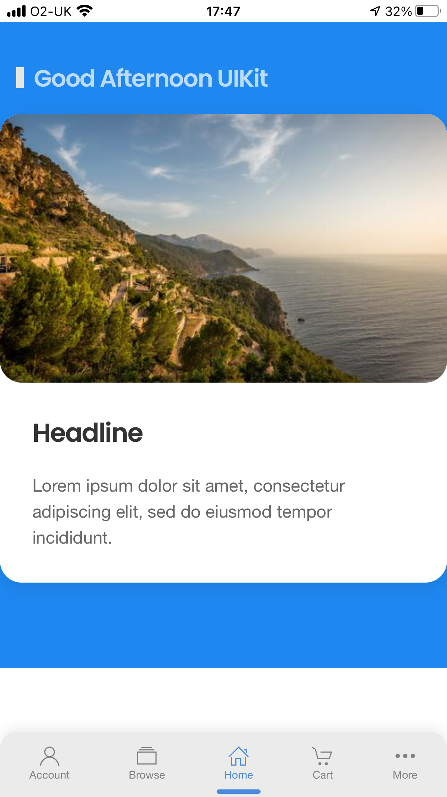

# uikit-mobile-app
Extension for UIKit css for building hybrid and Cordova apps easily. See https://github.com/uikit/uikit for more about UIkit.

This will be a very simple drop in css along with samples for an iOS inspired app framework. BUT we are not
trying to look 100% like iOS - in fact to have a recognisable app style that works for both iOS and Android users.

Ideally suited to server rendered applications like e-commerce. Our experience shows that not a lot is gained from having a 
client rendered front end and passing json data. With frameworks such as ASP.NET - it is just as quick, and MORE productive
to render the full output on the server.

This is work in progress at the moment - see it as it happens at https://www.hengardirect.co.uk/test 

You can open in Safari on iPhone and save to desktop to see a more app-like experience. There is still a LOT to do and comments welcome!

## Planned features

- Fixed bottom toolbar with icons, captions and a choice of button highlighting
- Switcher for fast navigation between tabs
- Ajax loading of pages after initial load
- Tweaks to exising styles to be more "mobile app" like

